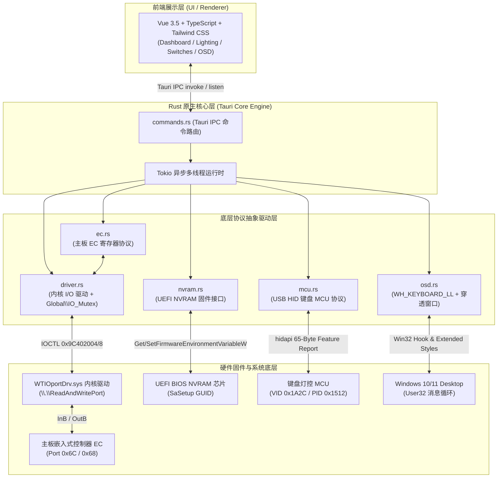

# Machenike L16W Center (机械师智能控制中心)

<p align="center">
  
</p>

<p align="center">
  <b>面向机械师（Machenike）L16W 旗舰游戏本深度定制的下一代原生硬件控制中心与驱动套件</b><br>
  <i>A modern, ultra-lightweight, 64-bit native hardware control center & driver suite for Machenike L16W laptops.</i>
</p>

<p align="center">
  <a href="#-痛点与重构价值对比"></a>
  <a href="#"></a>
  <a href="#"></a>
  <a href="#"></a>
  <a href="#"></a>
  <a href="#"></a>
  <a href="#"></a>
  <a href="#"></a>
</p>

---

## 🌐 导航 / Navigation

- [中文文档 (Chinese Guide)](#中文文档)
  - [⚡ 痛点与重构价值对比](#-痛点与重构价值对比)
  - [✨ 全景核心特性](#-全景核心特性)
  - [🔬 系统底层通信架构与逆向解密](#-系统底层通信架构与逆向解密)
  - [🛠️ 项目工程拓扑图](#️-项目工程拓扑图)
  - [🚀 开箱使用与脱机部署指南](#-开箱使用与脱机部署指南)
  - [💻 开发者与编译构建指引](#-开发者与编译构建指引)
  - [⚠️ 硬件安全与免责声明](#️-硬件安全与免责声明)
- [English Documentation](#english-overview)
  - [Key Features](#key-features)
  - [Benchmark vs Original HEOSD](#benchmark-vs-original-heosd)
  - [Low-Level Architecture Summary](#low-level-architecture-summary)
  - [Getting Started & Build Guide](#getting-started--build-guide)

---

<a name="中文文档"></a>
# 中文文档

## ⚡ 痛点与重构价值对比

机械师 L16W 原厂自带的控制套件基于老旧的 32 位 WPF/.NET 架构（位于 `C:\Program Files (x86)\HEOSD\Machenike Control Center.exe`，并捆绑常驻后台的 `MachenikeOSD.exe`）。长期使用存在严重的资源浪费与体验缺陷：

| 对比维度 | 原厂 HEOSD 控制套件 (32-bit WPF) | Machenike L16W Center (本项目) |
| :--- | :--- | :--- |
| **常驻内存** | **300MB ~ 500MB+**（多进程常驻且有明显内存泄漏） | **~35MB**（Rust 零成本抽象 + WebKit 渲染内核，降低约 90%） |
| **冷启动耗时** | 3.5 秒 ~ 5 秒（.NET CLR 启动开销高） | **< 120 毫秒**（原生二进制秒开） |
| **运行时架构** | 32 位 x86 传统应用 + 外部 32 位 DLL 桥接 | **纯 64 位原生架构**，无任何 32 位 thunk 性能损耗 |
| **OSD 提示机制** | 独立窗口进程，全屏游戏易抢焦点、无法穿透点击 | **全局穿透毛玻璃 OSD**（`WS_EX_TRANSPARENT`，0 焦点剥夺） |
| **BIOS/NVRAM 交互** | 依赖高延迟中间动态库，易卡死 | **原生 Win32 固件 API 直驱** UEFI NVRAM 芯片 |
| **硬件 I/O 稳定性** | 无并发锁，与其他监控软件（如 AIDA64）抢端口易蓝屏 | 内置 **`Global\IO_Mutex` 跨进程原子事务锁**，防并发冲突 |
| **界面与视觉** | 陈旧扁平化 WinForm/WPF 质感，缩放模糊 | **暗黑毛玻璃电竞拟物风**（Tailwind CSS + 动态 SVG 仪表盘） |

---

## ✨ 全景核心特性

### 1. 🚀 性能与功耗模式调节 (Performance Modes)
- **办公模式 (Office)**：下调 CPU/GPU 功耗墙，温和的风扇策略（25~32 dB），适合图书馆、会议室码字与长续航办公。
- **游戏模式 (Gaming)**：出厂预设均衡模式，根据负载动态调整 CPU/GPU 功耗分配与双风扇转速。
- **狂暴模式 (Turbo)**：完全解锁处理器性能墙与显卡最大释放（PL2 / TGP），风扇全开激进散热，专为 3A 游戏与重载渲染而生。

### 2. 🌀 双风扇独立监控与全速强冷 (Thermal & Fan Studio)
- **独立 RPM 转速测速**：CPU 风扇与 GPU 风扇独立转速采集（0 ~ 6500 RPM），动态负荷百分比换算。
- **自研动态 SVG 环形仪表盘**：内置动画旋转速率与真实物理 RPM 严格关联，转速越高旋转越迅疾。
- **一键全速强冷 (Cooler Boost)**：硬件级强冷开关，毫秒级将双风扇拉满至极限转速（5000+ RPM），迅速压制峰值积热。
- **CPU / GPU 双温毫秒级感知**：实时上报硬件核心温度，具备健康/预警/高温三级动态色阶提示。

### 3. 🖥️ 原生 UEFI BIOS 固件直驱 (Advanced Hardware Controls)
- **独显直连 (MUX Switch)**：
  - 突破性脱离原厂 32 位 DLL，直接改写主板 UEFI NVRAM 中的固件配置变量 `SaSetup`。
  - 支持一键切换 **独显直连**（完全绕过核显，100% 性能释放）与 **混合输出**（日常核显省电）。
- **内存分频模式 (SAGV / Gear Mode)**：
  - 直控 Intel 内存控制器，在 **Gear 1**（关闭分频，极低内存延迟）与 **Gear 2**（开启分频，省电降温）间无缝调校。
  - 内置优雅的系统冷重启二次确认交互，一键完成 BIOS 硬件自检生效流程。

### 4. 🌈 4 分区 RGB 键盘灯光工坊 (Lighting Studio)
- **4 分区独立调色**：支持将全键盘划分为 A、B、C、D 四个独立光区，分别设定独立 RGB 色彩与流动速率，亦支持一键神光同步。
- **5 大硬件灯控物理区域**：整机神光同步 (Zone 4)、键盘背光 (Zone 0)、左侧电竞灯带 (Zone 1)、右侧电竞灯带 (Zone 2)、Logo 信仰灯 (Zone 3)。
- **8 种动态光效算法**：常亮 (AlwaysOn)、呼吸 (Breath)、海浪 (Wave)、彩虹 (Rainbow)、流光 (Flow)、钟摆 (Clock)、跳动 (Jump)、风行 (Wind)。
- **精细化灯效控制**：硬件亮度滑块、1~5 档流速调节、流动方向切换（向左/向右）、官方电竞预设色盘与本地持久化。

### 5. 🛡️ 机身供电与外设安全管控 (Power & Peripherals)
- **掌托无线快充 (Wireless Charging)**：控制机身 C 面掌托无线充电发射圈，内置 Win32 电源感知状态机（纯电池供电时自动锁定，防电池过放）。
- **Win 键硬件级防误触锁 (Win Lock)**：MCU 硬件寄存器直接禁用 Windows 徽标键，彻底杜绝激烈团战误切桌面。
- **键盘背光常亮 (Disable Timeout)**：彻底关闭 30 秒无操作键盘灯自动熄灭机制。
- **关机对外充电 (AOU - Always-On USB)**：电脑关机断电后，特定 USB 接口依然维持持续对外供电。

### 6. 🪟 现代化原生 OSD 悬浮提示 (Next-Gen OSD Overlay)
- **彻底告别原厂 `MachenikeOSD.exe` 进程**，彻底消除内存泄漏隐患。
- **底层全局键盘钩子（`WH_KEYBOARD_LL`）**：硬件级毫秒捕获 **Caps Lock 大写锁定** 与 **Num Lock 数字小键盘** 状态切换。
- **三重 Windows 扩展窗口属性**：
  - `WS_EX_TRANSPARENT`：鼠标点击**完全穿透**，绝不阻碍全屏竞技游戏或打字点击。
  - `WS_EX_TOOLWINDOW`：不在任务栏与 Alt+Tab 任务视图中残留多余图标。
  - `WS_EX_NOACTIVATE`：弹出悬浮卡片时**绝对不夺取焦点**，保障输入流绝不中断。
- **多显示器与 DPI 居中适配**：智能识别主显示器分辨率，居中于屏幕下方偏上 110px 处，避开系统任务栏；配有 3.5s 平滑倒计时进度条与 `AtomicU64` 代数防抖。

---

## 🔬 系统底层通信架构与逆向解密

本项目全链路采用分层设计，通过四种完全不同的底层硬件通道直击主板 EC、UEFI BIOS、键盘 MCU 与桌面系统环境：



### 协议机制 1：内核端口 I/O 与跨进程原子事务锁 (`driver.rs`)
- **驱动服务**：依赖经微软 WHQL 认证的内核级端口 I/O 驱动 `WTIOportDrv.sys`（注册系统服务名：`ioportdrv`）。
- **设备对象**：打开符号链接 `\\.\ReadAndWritePort`（`GENERIC_READ | GENERIC_WRITE`）。若驱动未运行，Rust 层具备智能自愈能力，自动调用 `sc.exe start ioportdrv` 拉起。
- **IOCTL 控制码**：
  - 读端口：`IOCTL_READ_PORT = 0x9C402004`，下发 `ReadPortBuffer { port: u16 }`，返回单字节。
  - 写端口：`IOCTL_WRITE_PORT = 0x9C402008`，下发 `WritePortBuffer { port: u16, data: u16 }`。
- **全局并发安全**：笔记本后台若有其他传感器监控工具并发读写端口，可能诱发系统蓝屏。本项目通过 Windows 全局命名互斥体 **`Global\IO_Mutex`** 配合进程内 `tokio::sync::Mutex`，形成两级 `transaction` 事务原子保护，确保同一时刻全系统仅有一个端口读写动作。

### 协议机制 2：主板 EC 嵌入式控制器寄存器时序 (`ec.rs`)
- **硬件 I/O 端口**：命令端口 `PORT_CMD = 0x6C`，数据端口 `PORT_DATA = 0x68`。
- **性能模式 (Thermal Mode)**：
  - 写入指令 `0xDE`，等待 10ms，向数据端口写入 `1` (Office)、`2` (Gaming) 或 `3` (Turbo)。
  - 查询当前模式时，写入 `0xDE` 后紧跟 `0x11`，随后读出模式数值。
- **风扇全速强冷 (Cooler Boost)**：
  - 开启：下发 `0xDE` + `14`（连续写入 2 次确保锁存）；关闭：下发 `0xDE` + `15`。
  - 读取强冷状态：写入 `0xDE` + `16`，读出 `1` 表示强冷生效。
- **双风扇 RPM 转速换算**：
  - 指令字 `0xD5`：
    - CPU 风扇：低字节索引 `24`，高字节索引 `25`，转速计算式为 `RPM = (high << 8) | low`。
    - GPU 风扇：低字节索引 `22`，高字节索引 `23`，转速计算式为 `RPM = (high << 8) | low`。
    - 硬件校验区间：`0 <= RPM <= 6500`，异常时自动平滑滤波。
- **CPU / GPU 温度采集**：
  - 指令字 `0xDD`：写入 `32` 采集 CPU 温度，写入 `35` 采集 GPU 温度。
  - 范围安全校验：仅采纳 `20°C ~ 115°C` 区间有效数值，配置 5 次瞬态重试与异常平滑回退。
- **供电与无线充电**：
  - AOU 关机充电：`0xDE` + `10`（开）/ `11`（关）；读取指令为 `0xDE` + `12`（值为 16 时为开启）。
  - 掌托无线快充：`0xDE` + `64` (0x40, 开) / `65` (0x41, 关)。结合 Win32 `GetSystemPowerStatus` 感知，无 AC 适配器供电时强制闭锁。

### 协议机制 3：UEFI BIOS NVRAM 固件直驱 (`nvram.rs`)
- **特权提权**：在运行时通过 `OpenProcessToken` 与 `AdjustTokenPrivileges` 激活当前进程的 **`SeSystemEnvironmentPrivilege`**（系统环境配置特权）。
- **固件环境变量**：
  - 变量名：`SaSetup`
  - GUID：`{72C5E28C-7783-43A1-8767-FAD73FCCAFFA}`
  - 缓冲区大小：4096 字节。
- **偏移量定位与改写**：
  - **独显直连 (MUX Switch)**：
    - 偏移地址 `0xB1` 与 `0xB7`。
    - 独显直连（Direct GPU）：`0xB1 = 0x01`, `0xB7 = 0x00`
    - 混合输出（Hybrid MSHybrid）：`0xB1 = 0x04`, `0xB7 = 0x02`
  - **内存分频 (SAGV / Gear Mode)**：
    - 偏移地址 `497` (`0x1F1`)。
    - Gear 1（关闭分频 / 极致低延迟）：设置为 `0`
    - Gear 2（开启分频 / 降温平衡）：设置为 `5`
- **冷重启调度**：调用 Win32 接口触发立即重启，以便主板开机自检阶段重新训练内存和显卡走线。

### 协议机制 4：USB HID 键盘背光 MCU 报文协议 (`mcu.rs`)
- **硬件特征**：供应商 ID `VID = 0x1A2C`，产品 ID `PID = 0x1512`。
- **复合接口定位**：精确匹配 `MI_03` 复合设备接口（Interface 3，或 UsagePage `0xFF00` / Usage `0x0002`）。
- **65 字节报文规范**：
  - `buffer[0] = 0x00` (Report ID)
  - `buffer[1] = cmd & 0xFF` (Command LSB)
  - `buffer[2] = (cmd >> 8) & 0xFF` (Command MSB)
  - `buffer[3..]` 为特定功能 Payload 数据段。
  - 双通道保障：优先调用 `dev.write` (Output Report)，失败时自动回退至 `dev.send_feature_report`。
- **核心控制指令集**：
  - `0xC001`：硬件电源总控与光区掩码（整机 0x00FF / 0x0000 掩码）。
  - `0xC003`：单光区 / 神光同步配置。特效模式 `effect | 0x80`（最高位置 1），写入亮度、`(speed << 4) | direction` 及前景色/背景色 RGB。
  - `0xC00B`：4 分区独立调色（每分区 10 字节封装：亮度、速度、R1,G1,B1, R2,G2,B2）。
  - `0xC007`：Windows 徽标键硬件级闭锁（`1` 闭锁，`0` 解锁）。
  - `0xC008`：背光休眠倒计时（传 `0` 永久禁用休眠，实现键盘灯常亮）。

### 协议机制 5：穿透式无焦点 OSD 悬浮卡片 (`osd.rs`)
- **低级键盘钩子**：后台独立线程启动标准 Win32 消息循环并挂载 `SetWindowsHookExW(WH_KEYBOARD_LL, ...)`。
- **毫秒按键判定**：在 `WM_KEYUP` 触发时，读取 `GetKeyState(VK_CAPITAL)` 与 `GetKeyState(VK_NUMLOCK)` 获取真实锁定状态。
- **窗口无感显示**：
  - 注册 `WS_EX_TRANSPARENT | WS_EX_TOOLWINDOW | WS_EX_NOACTIVATE` 样式。
  - 调用 `SetWindowPos`（带有 `SWP_NOACTIVATE | SWP_SHOWWINDOW`）确保弹出时全屏游戏不掉帧、光标焦点不丢失。
- **多屏自适应居中**：通过 `GetSystemMetrics` 配合主监视器 `scale_factor`，精准计算位置 `(screenWidth - width)/2`，垂直位置固定于屏幕底部上方 110px。
- **代数防抖机制**：采用 `static OSD_GENERATION: AtomicU64` 维护当前展示代数，当用户快速连续按键时平滑续期 3.5 秒展示时长，杜绝多线程竞争闪烁。

---

## 🛠️ 项目工程拓扑图

```text
d:\NodeJSProject\Machenike_L16W_Center\
├── driver/                             # 独立驱动文件目录
│   └── WTIOportDrv.sys                 # 微软官方 WHQL 认证内核端口 I/O 驱动
├── install_driver.bat                  # 一键独立安装/迁移驱动服务（自带 UAC 提权）
├── uninstall_driver.bat                # 一键卸载与清理驱动服务
├── src/                                # 前端源码 (Vue 3.5 + TypeScript + Tailwind)
│   ├── components/
│   │   ├── Sidebar.vue                 # 左侧主导航栏、品牌 Logo 与迷你状态卡
│   │   ├── Dashboard.vue               # 实时仪表盘：双风扇动态 SVG 测速与温控卡片
│   │   ├── ModeSelector.vue            # 办公/游戏/狂暴 性能模式卡片与功耗信息
│   │   ├── LightingStudio.vue          # RGB 键盘工坊：4 分区独立调色、神光同步与光效
│   │   ├── QuickSwitches.vue           # 快捷开关：独显直连、内存分频、无线充、Win锁等
│   │   └── OsdOverlay.vue              # 原生 OSD 悬浮窗（暗黑毛玻璃、倒计时条、穿透）
│   ├── services/
│   │   ├── tauri.ts                    # Tauri IPC 接口封装 (invoke) 与遥测事件监听 (listen)
│   │   └── lightingStore.ts            # 灯效状态集中响应式管理、持久化与下发调度
│   ├── types/
│   │   └── hardware.ts                 # 硬件遥测、BIOS 变量、OSD 与灯效契约定义
│   ├── App.vue                         # 主应用容器、标签页切换、轮询控制与全局 Toast
│   ├── main.ts                         # 前端入口：智能识别主窗口与 OSD 窗口独立挂载
│   └── style.css                       # 暗黑电竞风格、毛玻璃背景与滚动条美化
├── src-tauri/                          # Tauri + Rust 原生后端工程
│   ├── capabilities/                   # Tauri 2.0 权限与功能配置
│   ├── icons/                          # 多分辨率应用图标 (ico, png, icns)
│   ├── nsis/
│   │   └── installer_hooks.nsh         # NSIS 安装包生命周期钩子（安装时自动注册驱动）
│   ├── resources/
│   │   └── WTIOportDrv.sys             # 打包内置驱动资源
│   ├── src/
│   │   ├── commands.rs                 # Tauri IPC 暴露的 Command 接口映射
│   │   ├── driver.rs                   # \\.\ReadAndWritePort 内核驱动通信与跨进程锁
│   │   ├── ec.rs                       # 主板 EC 寄存器协议 (风扇/功耗/温度/供电)
│   │   ├── mcu.rs                      # USB HID 键盘灯控协议 (VID 0x1A2C / PID 0x1512)
│   │   ├── nvram.rs                    # Win32 UEFI NVRAM 固件接口 (独显直连/内存分频)
│   │   ├── osd.rs                      # 全局底层键盘钩子 (WH_KEYBOARD_LL) 与无焦点管理
│   │   ├── lib.rs                      # Tauri 运行时初始化、系统托盘、事件总线
│   │   └── main.rs                     # 二进制可执行文件入口
│   ├── Cargo.toml                      # Rust 项目依赖与编译配置
│   └── tauri.conf.json                 # Tauri 2.0 应用、双窗口（main/osd）与打包元数据
├── package.json                        # Node.js 脚本与依赖
├── vite.config.ts                      # Vite 配置文件
├── tailwind.config.js                  # Tailwind CSS 样式配置
├── tsconfig.json                       # TypeScript 编译配置
└── (逆向与诊断辅助工具)
    ├── diagnose_reads.py               # EC 寄存器连续读取诊断脚本
    ├── test_transaction.py             # 命名互斥体事务锁并发测试脚本
    ├── disasm_sysinfo.ps1              # 原厂 SysInfo.dll 反汇编逆向脚本
    └── disasm_timer.ps1                # 原厂定时器线程反汇编分析脚本
```

---

## 🚀 开箱使用与脱机部署指南

如果您想立即使用本项目并**彻底脱离臃肿的原厂 HEOSD 软件**，请按以下步骤操作：

### 步骤 1：一键安装驱动服务
1. 鼠标右键以**管理员身份运行**项目根目录下的 **`install_driver.bat`**（或直接双击，会自动弹出 UAC 提权申请）。
2. 脚本将自动执行以下操作：
   - 将 WHQL 签名驱动 `WTIOportDrv.sys` 复制到系统驱动目录 `C:\Windows\System32\drivers`。
   - 创建或重定向 Windows 内核服务 `ioportdrv` 并设置为自启动。
   - 立即拉起该服务并验证运行状态。

### 步骤 2：彻底卸载/物理删除原厂 HEOSD
驱动独立部署验证成功后，原厂软件的依赖已被彻底切断：
1. 打开 Windows 设置 -> 应用 -> 安装的应用，卸载原厂 `Machenike Control Center`（或 `HEOSD`）。
2. 或者直接进入 `C:\Program Files (x86)\`，彻底**物理删除 `HEOSD` 文件夹**！
3. 任务管理器中再无吃内存的 `MachenikeOSD.exe`，系统常驻内存直降 300MB+。

### 步骤 3：运行本程序
- 运行编译生成的 `Machenike L16W Center.exe`，尽享毫秒级响应与暗黑电竞控制中心！

### 驱动服务卸载
若未来需要清理或移除驱动服务：
- 鼠标右键以管理员身份运行项目根目录下的 **`uninstall_driver.bat`** 即可停止并清理系统服务。

---

## 💻 开发者与编译构建指引

### 1. 开发环境准备
确保本地开发机已安装以下工具链：
- **操作系统**：Windows 10 / Windows 11 (64-bit)
- **Node.js**：`>= 18.0.0`（推荐 LTS 20.x）
- **包管理器**：`pnpm >= 8.0.0`
- **Rust 工具链**：`>= 1.75.0`（MSVC 工具链 `x86_64-pc-windows-msvc`）
- **C++ 生成工具**：Visual Studio 2022 C++ 生成工具（勾选 "C++ 桌面开发" 及 Windows 10/11 SDK）

### 2. 安装项目依赖
```powershell
# 克隆仓库后进入目录
cd Machenike_L16W_Center

# 安装前端依赖
pnpm install
```

### 3. 本地开发与热更新调试
```powershell
# 启动 Tauri 联调模式（自动拉起 Vite 前端开发服务器并编译 Rust 后端）
pnpm tauri dev
```
> **提示**：首次编译需下载 Rust crates 依赖，编译耗时视机器性能约需 1~3 分钟。开发阶段主窗口与 OSD 窗口均支持前端 HMR 热更新。

### 4. 编译发布包 (Release EXE / NSIS 安装程序)
```powershell
# 编译可供分发的最终 Release 安装包
pnpm tauri build
```
- 构建生成的安装包文件位于：`src-tauri/target/release/bundle/nsis/`。
- 本项目的 NSIS 打包配置（`installer_hooks.nsh`）已深度定制：**用户运行安装包安装时，安装程序会自动将内置的驱动部署至 `System32\drivers` 并注册自启服务**，真正实现终末用户零门槛一键开箱即用。

---

## ⚠️ 硬件安全与免责声明

> [!CAUTION]
> **硬件与固件操作安全须知**
> 1. **独显直连与内存分频 (NVRAM)**：本项目涉及对主板 UEFI NVRAM 中 `SaSetup` 固件变量的直接写操作。虽然已严格限定偏移量并经过深入反汇编验证，但固件层操作存在主板自检重置风险。切换设置后请务必通过弹窗引导冷重启，切勿在开机过程中强行拔电源。
> 2. **内核驱动权限**：`WTIOportDrv.sys` 具备对机器物理 I/O 端口的直接读写能力。请勿在未受保护的第三方并发环境下随意调用未经校验的端口，以免引发系统蓝屏 (BSOD)。
> 3. **免责声明**：本项目为开源逆向重构作品，非机械师（Machenike）官方赞助或维护。使用者需自行承担因异常断电、固件损坏或极端超频引发的潜在硬件风险。

---

<a name="english-overview"></a>
# English Overview

**Machenike L16W Center** is a high-performance, lightweight, 64-bit native hardware control center & driver suite specifically designed for **Machenike L16W** gaming laptops. Built with **Tauri 2.0 + Rust + Vue 3 + Tailwind CSS**, it completely supersedes the bloated, memory-leaking, legacy 32-bit WPF `HEOSD` vendor software.

### Key Features
- **Ultra-Lightweight Footprint**: Idle memory footprint drops from 300MB~500MB down to **~35MB** (a 90%+ reduction).
- **Pure 64-bit Architecture**: Bypasses slow 32-bit intermediate wrappers, directly communicating with Windows kernel driver `\\.\ReadAndWritePort` and Win32 UEFI NVRAM APIs.
- **UEFI NVRAM Direct Drive**:
  - **MUX Switch**: Toggle between Discrete GPU Direct Mode (100% GPU performance) and MSHybrid (dynamic power saving) via firmware variable `SaSetup`.
  - **SAGV / Memory Gear Mode**: Switch between Gear 1 (zero-divider, ultra-low memory latency) and Gear 2 (energy saving).
- **Thermal & Fan Control**:
  - Independent CPU and GPU fan RPM real-time telemetry (0 ~ 6500 RPM) with dynamic animated SVG tachometers.
  - **Cooler Boost**: One-click instantaneous fan speed ramp-up (5000+ RPM).
  - Accurate CPU / GPU core temperature monitoring with 3-tier color alerts.
- **Lighting Studio**:
  - 4-zone independent RGB keyboard backlighting.
  - 5 hardware lighting physical zones (Keyboard, Left lightbar, Right lightbar, Logo, and Sync-All).
  - 8 dynamic lighting patterns (Always-On, Breath, Wave, Rainbow, Flow, Clock, Jump, Wind).
- **Modern Click-Through OSD Overlay**:
  - Zero dependencies on the legacy `MachenikeOSD.exe` process.
  - Low-level keyboard hook (`WH_KEYBOARD_LL`) tracks **Caps Lock** and **Num Lock** changes at millisecond precision.
  - Configured with `WS_EX_TRANSPARENT | WS_EX_TOOLWINDOW | WS_EX_NOACTIVATE`: 100% click-through, non-focus-stealing, perfectly suited for full-screen competitive gaming.
- **Peripherals & Power Safety**: Palmrest wireless charging (with Win32 battery lock protection), hardware Win Key lock, keyboard timeout override, and Always-On USB (AOU).

### Benchmark vs Original HEOSD
| Benchmark | Original HEOSD (.NET WPF 32-bit) | Machenike L16W Center (This Project) |
| :--- | :--- | :--- |
| **RAM Footprint** | 300MB ~ 500MB+ (severe leaks) | **~35MB** (Rust zero-cost abstraction) |
| **Cold Startup Time** | 3.5s ~ 5s (.NET CLR overhead) | **< 120ms** (Instant binary launch) |
| **Process Architecture** | 32-bit x86 legacy | **Pure 64-bit native** |
| **OSD Overlay** | Clunky separate process, steals focus | **Click-through frosted glass** (`WS_EX_TRANSPARENT`) |
| **Firmware Control** | Dependent on slow 32-bit DLLs | **Native Win32 UEFI NVRAM API** (`SaSetup`) |
| **I/O Safety** | No concurrency mutex; prone to BSOD | **Global `Global\IO_Mutex` atomic transaction** |

### Low-Level Architecture Summary
1. **PortDriver (`driver.rs`)**: Connects to WHQL-certified `WTIOportDrv.sys` via `\\.\ReadAndWritePort`. Protected by `Global\IO_Mutex` cross-process transaction locks.
2. **EC Protocol (`ec.rs`)**: Direct EC registers I/O at command port `0x6C` and data port `0x68`. Controls thermal modes (`0xDE`), cooler boost (`0xDE + 14/15`), temperature polling (`0xDD`), and fan RPM calculation (`0xD5`).
3. **UEFI NVRAM (`nvram.rs`)**: Uses `SeSystemEnvironmentPrivilege` and Win32 firmware APIs to read/write `SaSetup` (`{72C5E28C-7783-43A1-8767-FAD73FCCAFFA}`). Offsets: `0xB1`/`0xB7` for MUX Switch, `497` for Gear Mode.
4. **USB HID MCU (`mcu.rs`)**: Matches `VID: 0x1A2C`, `PID: 0x1512` composite interface `MI_03`. Delivers 65-byte Feature/Output reports (`0xC001` ~ `0xC00B`) for per-zone RGB and hardware locks.
5. **OSD Hook (`osd.rs`)**: Win32 low-level keyboard hook (`WH_KEYBOARD_LL`) + DPI-aware primary screen center positioning with `AtomicU64` debounce.

### Getting Started & Build Guide
```powershell
# 1. Standalone Driver Service Setup (Run as Administrator)
.\install_driver.bat

# 2. Safely Remove the Original HEOSD
# You can now cleanly delete or uninstall C:\Program Files (x86)\HEOSD

# 3. Development
pnpm install
pnpm tauri dev

# 4. Build Release Package
pnpm tauri build
```
*(The release NSIS installer automatically configures and starts the kernel driver service during user installation).*

---

<p align="center">
  <b>Machenike L16W Center</b> &copy; 2026. Made with ❤️ for gamers & enthusiasts.
</p>
